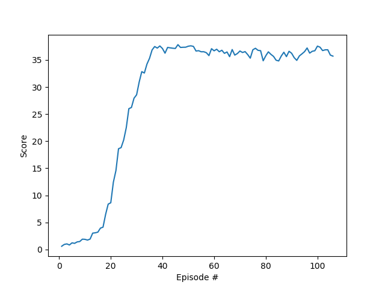

## DRL - DDPG Algorithm - Reacher Continuous Control

### Model Architecture
The Udacity provided DDPG code in PyTorch was used and adapted for this 20 agent (version 2) environment.

The algorithm uses two deep neural networks (actor-critic) with the following struture:
- Actor    
    - Hidden: (input, 256)  - ReLU
    - Hidden: (256, 128)    - ReLU
    - Output: (128, 4)      - TanH

- Critic
    - Hidden: (input, 256)              - ReLU
    - Hidden: (256 + action_size, 128)  - ReLU
    - Output: (128, 1)                  - Linear

### Hyperparameters
- Learning Rate: 1e-4 (in both DNN)
- Batch Size: 128
- Replay Buffer: 1e5
- Gamma: 0.99
- Tau: 1e-3
- Ornstein-Uhlenbeck noise parameters (0.15 theta and 0.2 sigma.)

## Results and Future Work
The actual model got really impressive results.

I plan to now implement the D4PG and test it in both environments, the reacher and the crawler.
The goal is to find when and where each of the algorithms have the best performance.
